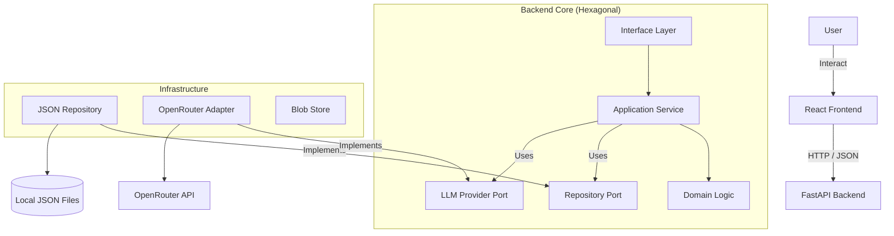
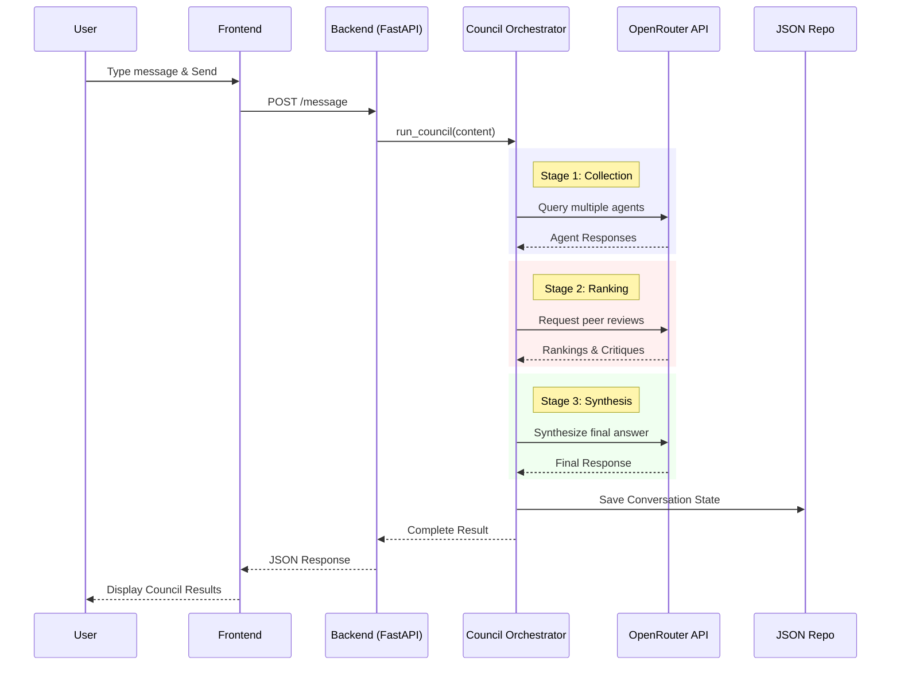

# System Architecture

## 1. High-Level Overview

**LLM Council** is a collaborative AI decision-support system that leverages multiple Large Language Models (LLMs) to provide diverse perspectives on a user's query. It employs a "council" of AI agents—each with a distinct persona or specialty—to deliberate, rank responses, and synthesize a final consensus, mimicking a human board meeting.



## 2. Design Patterns & Principles

### Architectural Pattern: **Hexagonal Architecture (Ports and Adapters)**

This project adheres to **Hexagonal Architecture** to decouple the core business logic from external dependencies like the web framework, database, and LLM providers.

*   **Why this fits:** The core logic (the "Council" deliberation process) is complex and independent of how data is stored or which LLM provider is used. This allows for easy swapping of the AI provider or storage mechanism without touching the deliberation logic.

### Key Principles
*   **Separation of Concerns:** Distinct layers for `domain` (models), `application` (orchestration), `infrastructure` (implementation), and `interface` (API).
*   **Dependency Inversion:** High-level modules (Application) do not depend on low-level modules (Infrastructure); both depend on abstractions (Ports).
*   **File-Based Persistence:** Designed for local/single-user deployment, using the filesystem for simplicity and portability.

## 3. Tech Stack

| Category | Technology | Purpose |
| :--- | :--- | :--- |
| **Frontend** | React 19, Vite | Single-page application (SPA) for the user interface. |
| **Styling** | CSS Modules | Component-scoped styling. |
| **Backend** | Python 3.10+, FastAPI | High-performance async REST API. |
| **Runtime** | Uvicorn | ASGI server for production. |
| **Validation** | Pydantic | Data validation and settings management. |
| **Persistence** | Local JSON & Blobs | Simple file-based storage for conversations and attachments. |
| **AI Provider** | OpenRouter API | Aggregated access to various LLMs (GPT-4, Claude, etc.). |
| **Package Mgmt** | `uv` / `pip` | Python dependency management. |

## 4. Codebase Structure (Annotated)

```text
/workspaces/llm-council/
├── backend/
│   ├── application/       # Orchestration logic & use cases (The "What")
│   │   ├── council_service.py # Core logic running the council process
│   │   └── prompt_builder.py  # Assembles prompts for LLMs
│   ├── domain/            # Pure business entities & rules (The "Heart")
│   │   └── models.py          # Pydantic models (Conversation, Message)
│   ├── infrastructure/    # External implementations (The "How")
│   │   ├── json_repository.py # File-based persistence adapter
│   │   ├── openrouter_adapter.py # Adapter for OpenRouter API
│   │   └── blob_store.py      # Local file storage for attachments
│   ├── interface/         # API Entry points (The "Door")
│   │   └── ...            # (Future expansion for routers)
│   ├── config.py          # Configuration & env vars
│   ├── main.py            # Application entry point & dependency wiring
│   └── ports.py           # Abstract interfaces (Ports)
├── frontend/
│   ├── src/
│   │   ├── components/    # Reusable React UI components
│   │   ├── api.js         # API client for backend communication
│   │   └── App.jsx        # Main application layout
│   └── vite.config.js     # Build configuration
└── data/                  # Runtime storage (Conversations & Blobs)
```

## 5. Core Data Flow

### Request Cycle: sending a Message to the Council

1.  **User** sends a prompt via the Chat Interface.
2.  **Frontend** POSTs the message to `/api/conversations/{id}/message`.
3.  **FastAPI** controller receives the request and invokes the `CouncilOrchestrator`.
4.  **Orchestrator** executes the 3-Stage Process:
    *   **Stage 1:** Calls `OpenRouterAdapter` to get responses from multiple agents.
    *   **Stage 2:** Calls `OpenRouterAdapter` to have agents rank peer responses.
    *   **Stage 3:** Calls `OpenRouterAdapter` to synthesize the final answer.
5.  **Repository** saves the conversation state to `data/conversations/` as JSON.
6.  **Response** is streamed or returned as JSON to the Frontend.



## 6. Key Components

1.  **Council Orchestrator (`backend/application/council_service.py`)**
    *   **Responsibility:** Manages the lifecycle of a council session. It coordinates the parallel execution of LLM requests, error handling during API calls, and aggregates results between stages.
    *   **Dependencies:** `LLMProvider` (Port), `ConversationRepository` (Port).

2.  **OpenRouter Adapter (`backend/infrastructure/openrouter_adapter.py`)**
    *   **Responsibility:** Implements the `LLMProvider` interface. Handles the specific HTTP requests to OpenRouter, manages API keys, and normalizes the diverse responses from different models into a standard format.
    *   **Dependencies:** `httpx`, `config`.

3.  **JsonConversationRepository (`backend/infrastructure/json_repository.py`)**
    *   **Responsibility:** Implements the `ConversationRepository` interface. Serializes domain objects to JSON files on disk, acting as a lightweight database suitable for single-tenant use.
    *   **Dependencies:** `domain.models`, `json`, `os`.

## 7. Deployment & Infrastructure

*   **Local Development:**
    *   Backend runs via `uvicorn` (port 8001).
    *   Frontend runs via `vite` dev server (port 5173).
    *   Communication is direct (CORS enabled for localhost).
*   **Environment:**
    *   Requires a `.env` file with `OPENROUTER_API_KEY`.
    *   Data is persisted to the local `./data` directory (must be persistent in containerized environments).
*   **Production (Self-Hosted):**
    *   Typically deployed as a Docker container or via a process manager (systemd/supervisord).
    *   Frontend is built (`npm run build`) and served statically or via a reverse proxy (Nginx) alongside the API.
