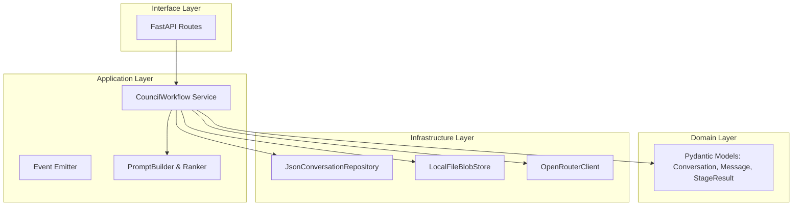

# Architecture Refactoring Guide: Project LLM-Council
**Target Architecture:** Modular Hexagonal (Ports & Adapters)  
**Goal:** Decouple business logic from infrastructure to enable testability, fix state issues, and ensure future portability.

---

## 1. Target Architecture Overview

We are moving away from a monolithic "script-based" architecture toward a **Service-Oriented** architecture. The application will be divided into clearly defined layers.

### The Layers
1.  **Domain Layer (Stable):** 
    *   Pure data models and business rules. 
    *   *Does not know about files, APIs, or databases.*
2.  **Application Layer (Orchestration):** 
    *   Services that coordinate the "Council" workflow.
    *   *Knows "what" must happen (Prompt -> Stage 1 -> Stage 2), but not "how" data is stored.*
3.  **Infrastructure Layer (Volatile):** 
    *   Adapters that talk to the outside world (File System, OpenRouter API).
    *   *Implements interfaces defined by the Application layer.*
4.  **Interface Layer (Entry Point):**
    *   FastAPI routes.
    *   *Responsible only for HTTP requests/responses and calling the Application layer.*

### Conceptual Component Map

---

## 2. Refactoring Phases

This refactor is broken into 5 sequential stages. Each stage leaves the application in a fully functional state.

### Phase 1: Domain Modeling & Metadata Persistence
**Primary Goal:** Fix the "amnesia" bug where rankings and label mappings are lost on page reload.
**Secondary Goal:** Type safety via Pydantic.

*   **Step 1.1:** Create `backend/domain/models.py`. Define `Conversation`, `Message`, and `CouncilRun` classes using Pydantic.
*   **Step 1.2:** **Crucial Change:** Add a `metadata` dictionary field to the `AssistantMessage` model. This will hold the `anonymized_label_map` and `aggregate_rankings`.
*   **Step 1.3:** Update `council.py` logic to populate this `metadata` field when generating the final response.
*   **Step 1.4:** Update `storage.py` to handle Pydantic serialization/deserialization.

> **Success Criteria:** You can complete a council run, refresh the web page, and the specific peer rankings and "Response A = Model X" mappings are still visible in the UI.

### Phase 2: The Blob-Store Split
**Primary Goal:** Prevent JSON file bloat and prepare for database size limits.
**Context:** Storing file content (code files, PDFs) inline inside the conversation JSON is an anti-pattern that impedes performance and migration.

*   **Step 2.1:** Create a new folder `data/blobs`.
*   **Step 2.2:** Create a utility `backend/infrastructure/blob_store.py`.
    *   Method: `save_text(content: str) -> str` (Returns a UUID or hash).
    *   Method: `get_text(reference_id: str) -> str`.
*   **Step 2.3:** Update the `UserMessage` domain model. Instead of holding raw `file_content`, it should hold a `file_reference_id`.
*   **Step 2.4:** Update the Prompt Builder logic to resolve these IDs using `blob_store.get_text()` when constructing the string for the LLM.

> **Success Criteria:** A conversation with large file attachments results in a small `<50kb` JSON file in `data/conversations`, while the file content exists separately in `data/blobs`. The app functions normally.

### Phase 3: Infrastructure Abstraction (The Repository Pattern)
**Primary Goal:** Isolate filesystem logic to a single module.

*   **Step 3.1:** Define abstract interfaces in `backend/ports.py`:
    *   `ConversationRepository`: `get(id)`, `save(obj)`, `list()`.
    *   `LLMProvider`: `chat(messages)`, `stream_chat(messages)`.
*   **Step 3.2:** Move existing logic from `storage.py` into `backend/infrastructure/json_repository.py` (implementing `ConversationRepository`).
*   **Step 3.3:** Move existing logic from `openrouter.py` into `backend/infrastructure/openrouter_adapter.py` (implementing `LLMProvider`).
*   **Step 3.4:** Update `main.py` to instantiate these adapters and inject them into your route handlers.

> **Success Criteria:** No route logic imports `json` or `os`. Routes call `repo.get()` instead of `load_conversation_from_disk()`.

### Phase 4: Service Layer Unification
**Primary Goal:** Remove business logic from FastAPI routes and unify streaming/non-streaming logic.

*   **Step 4.1:** Create `backend/application/council_service.py`.
*   **Step 4.2:** Migrate the orchestration logic (the "while loop" of stages) from your current routes/scripts into a class `CouncilOrchestrator`.
*   **Step 4.3:** **Event Logic:** Refactor the service to be a Python Async Generator. It should yield Domain Events (e.g., `StageStarted`, `ModelThinking`, `StageCompleted`) rather than raw bytes or strings.
*   **Step 4.4:** Update FastAPI routes to consume this generator:
    *   The SSE route converts events to `yield f"data: {json.dumps(event)}\n\n"`.
    *   The non-streaming route consumes all events and returns the final result.

> **Success Criteria:** The business logic exists in only **one** place (the Service). The two endpoints (stream/no-stream) utilize the exact same code path.

### Phase 5: Frontend Alignment
**Primary Goal:** Ensure the UI interacts cleanly with the new rigid data structures.

*   **Step 5.1:** Update the frontend API client to expect the standardized `AssistantMessage` structure (with `metadata`).
*   **Step 5.2:** Refactor the frontend state machine to handle the explicit Domain Events emitted in Phase 4 (e.g., updating a "Thinking..." indicator when `StageStarted` is received).

---

## 3. Developer Guidelines for this Refactor

1.  **Dependency Injection:** Pass dependencies (Repositories, LLM Providers) into constructors. Avoid global variables. usage allows us to easily swap `JsonRepository` for `FirestoreRepository` later.
2.  **Statelessness:** The backend service should be stateless. All state must be passed in via arguments or retrieved from the Repository.
3.  **Files vs. Data:** Never rely on the existence of a specific file path in the business logic layer. Always ask the `BlobStore` or `Repository`.
4.  **Testing:** With Phase 3 complete, you should write a unit test using a `MockLLMProvider` that runs the full Council flow without making a single network call to OpenRouter.